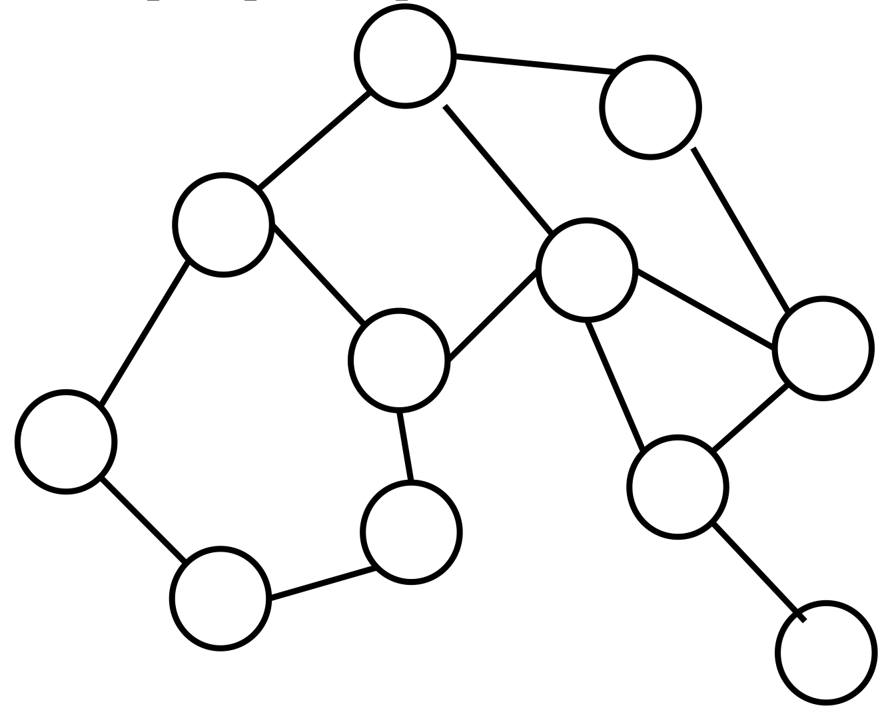
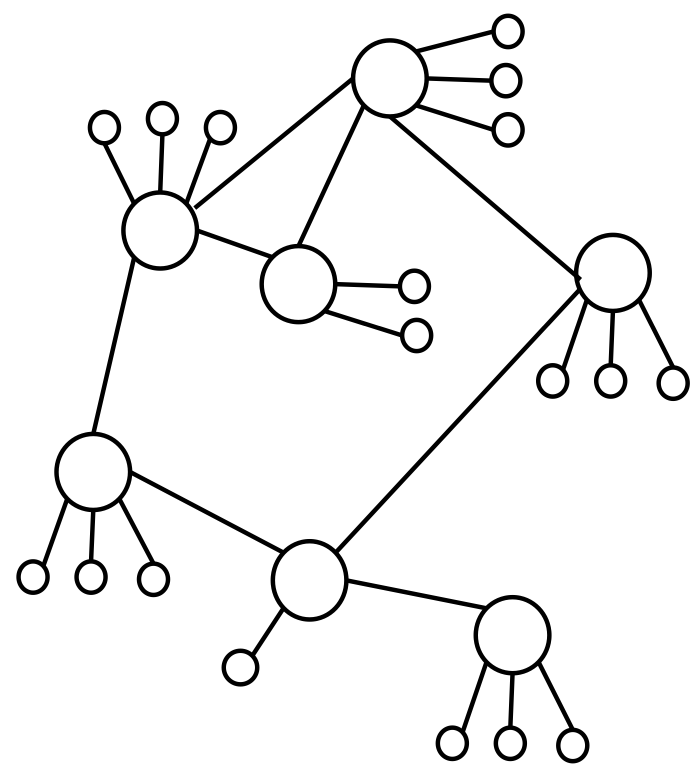
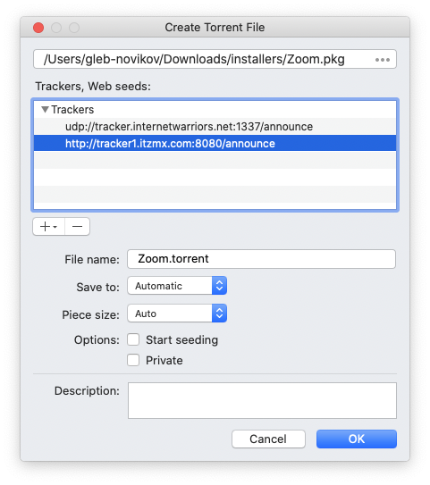

# Семинар по P2P

Многие наверняка уже слышали о модели P2P. А если не слышали о ней, то хотя бы слышали о торрентах и о том, что с их помощью можно быстро качать файлы. Сегодня мы вспомним ещё раз, какие модели бывают, какое место среди них занимает P2P, а так же обсудим самый популярный пример P2P — протокол BitTorrent.

Список источников, по которым готовился семинар:
  1. Статья [P2P Networks for Content Sharing](https://arxiv.org/pdf/cs/0402018.pdf), секции 1 и 2

     Тут общие слова про различные модели взаимодействия, хорошие простые иллюстрации, есть ещё разбор других реализаций сетей в секциях 3-6 (Napster, Gnutella, FastTrack, OpenFT), но эта информация нам не нужна.
  2. Интересный и простой [RFC 5694 про P2P в целом](https://tools.ietf.org/html/rfc5694#section-2.1) с примерами.

  3. [BitTorrent Protocol 1.0](http://jonas.nitro.dk/bittorrent/bittorrent-rfc.html)

     Можно использовать как справочник по деталям реализации BTP/1.0. Скорее man по протоколу, чем его последовательное и читабельное описание.

  4. [BitTorrent Enhancement Proposal 3: The BitTorrent Protocol Specification](http://www.bittorrent.org/beps/bep_0003.html)
  
      Официальная спецификация от автора, довольно бедная и не очень понятная, чисто для ознакомления и если захочется потыкаться руками в трекеры, подекодировать .torrent-файлы и всё такое.
  
  5. Статья [Peer-to-peer networking with BitTorrent](http://web.cs.ucla.edu/classes/cs217/05BitTorrent.pdf#page9)

     Читаемая, но не исчерпывающая статья о том, как устроен BitTorrent.

**Основной материал содержится в 1, 4 и 5.**

## Различные модели взаимодействия
Как уже обсуждалось на нашем курсе, существуют различные модели взаимодействия между какими-то участниками: клиент-серверная модель (http запросы и ответы), древесная или иерархичная модель (резолв доменного имени в DNS), кольцевая модель (обычный gossip с рассылкой двум соседям), полностью распределённая peer-to-peer (BitTorrent, Bitcoin) и гибридные модели из вышеперечисленных.

### Client-server

Привычная нам модель взаимодействия — когда есть некий клиент, например, браузер, отображающий HTML страничку, и сервер, содержащий в себе информацию, необходимую для отображения HTML странички. Клиент посылает запрос серверу, тот отвечает, всё просто.


### Tree

Древесная модель взаимодействия не супер часто встречается, но мы можем вспомнить, например DNS. Если узел не знает ответа на запрос, то он идёт опрашивать указанных у него других серверов.


### Ring

Кольцевая модель при частом взаимодействии узлов между собой не очень надёжная по понятным причинам — кольцо может разорваться. Но на основе такой модели тоже можно что-нибудь делать, например если кто-то использует consistent hashing load balancing (когда нода для ответа на запрос выбирается с помощью хэширования источника запроса и выбирается ближайший по часовой стрелке узел), то при выпадении или добавлении узлов надо будет передать или забрать промежуток хэшей у других нод.


### Decentralized (P2P)

На этой модели взаимодействия строятся честные распределённые системы без единой точки отказа. В такой модели все участники сети равны. Классический пример такой системы — современный BitTorrent без участия трекера. Клиент, установленный на вашем компьютере, одновременно является сервером. Ещё один популярный каноничный пример это Bitcoin, в сети которого все участники равноправны.



### Гибридные модели

В реальном мире, как и следовало ожидать, в основном встречаются смешанные модели. Например, если рассматривать множество "client + DNS", то это будет гибрид клиент-серверной модели и иерархичной (древесной). Клиенты ничего не знают и отправляют DNS серверам, которые отвечают на вопрос посредством древесного взаимодействия между собой.

(такой картинки не было)

На самом деле, при должном уровне изоляции, во всех этих моделях любой узел может быть заменён на любую другую модель. Например, если в клиент-серверной модели заменить сервер на честное распределённое приложение (например, распределенная no-sql база данных Cassandra), то клиент сможет обращаться к любому узлу за данными, а узлы между собой как-нибудь разберутся, откуда ему эти данные отдать.



## BitTorrent Protocol 1.0 (2002)
_Эта часть является компиляцией и интерпретацией информации из интернета и может содержать неточности, за точными ответами на вопросы лучше идти в источниками 3-5._

Теперь давайте посмотрим подробнее на пример честной peer-to-peer (P2P) системы — BitTorrent.

### Предыстория и философия

Никакой магической предыстории у BitTorrent нет. Разработчик Bram Cohen однажды заметил, что идею разделения файлов на маленькие кусочки можно использовать для оптимизации передачи файлов. В 2001 он представил первую версию для тестирования, а в 2002 рассказал её на конференции. Первичный посыл был дать людям быстрый способ раздавать новые дистрибутивы Linux, но, как мы можем догадаться, технологию быстро начали использовать для шаринга не только свободно распространяемых дистрибутивов. Через некоторое время, пиратские раздачи стали основным способом использования BitTorrent. Скорее всего, из-за этого торренты часто ассоциируются у людей, в том числе принимающие законадательные решения, с чем-то нелегальным или вовсе запрещённым. В некоторых странах Европы за любой P2P трафик к вам может прийти наряд полиции и выписать внушительный штраф.

Теперь пару слов об алгоритме. Предположим, мы хотим поделиться файлом с друзьями где-то в начале нулевых. В нашем распоряжении будут какие-то мегабиты на скачивание и сотни килабит на раздачу, а трафик какой-нибудь из сторон наверняка будет ограничен. Поскольку мы хотим поскорее поставить на свой компьютер свежевыпущенный дистрибутив, мы будем максимизировать скорость скачивания. Очевидно, что если отдавать файл напрямую с одного узла другому, то скорость скачивания у нас будет ограничена скоростью раздачи у источника раздачи. А если у истоничка есть ещё и ограничение на трафик, то мы бы не хотели его быстро истратить, так как до конца месяца всё наше маленькое сообщество останется без новых дистрибутивов. Исходя из этих соображений, мы можем побить файл на много маленьких кусочков и скопировать их на несколько источников и если у меня файла нет, то я могу попросить разные кусочки у адекватного количества участников, например сразу у 5 узлов. Тогда сумма раздающих каналов скорее всего превысит мой скачивающий, а значит мы максимизируем мою скорость скачивания. Но чтобы нам было откуда скачать эти кусочки, надо, чтобы эти кусочки уже были у каких-то участников и участники не противились поделиться с нами. Получается несколько принципов, на которых будет построен наш алгоритм (в некотором роде, игра):
- максимизируем нашу персональную скорость скачивания всего файла
- куски должны появляться как можно раньше у как можно большего количества участников
- если участник отказывается делиться с нами куском, то мы не будем делиться с ним тем куском, который он у нас попросил
- если участник поделился с нами куском, то мы тоже поделимся с ним куском, если он попросит

Если следовать этим принципам, то получится довольно честный к участникам алгоритм — активные участники раздачи вознаграждены хорошей скоростью, а free riders довольствуются низкими скоростями на скачивание. Именно по этой причине рекомендуется открывать какой-нибудь порт (см. в клиенте BitTorrent) наружу — чтобы до вас могли достучаться из-за NAT вашего провайдера и как можно больше участников могли воспользоваться вашими ресурсами.

---

Итак, чтобы начать раздачу, нам надо в идеале иметь
- файлы, которые собираемся раздавать
- файл с метаинформацией для участников сети
- сервер, который будет _раздавать_ наш файл
- доступ к открытому порту на нашем узле от других участников, для которых мы хотим раздать файл

Если мы хотим скачать файл, то нам надо иметь
- файл с метаинформацией
- клиент (на самом деле он поставляется вместе с сервером), который будет качать куски у раздающих участников, а так же раздавать скачанные куски другим участникам

Как уже можно было догадаться, в случае с BitTorrent под _файлом с метаинформацией_ понимается файл `.torrent`, а под клиентом-сервером понимается любой BitTorrent клиент для вашей платформы (они просто реализуют BitTorrent Protocol) — BitTorrent, Transmission, Folx, ...

Внимательный читатель мог заметить, что кое-чего не хватает, а именно — какого-то источника информации об участниках сети. Действительно, если сейчас возможна раздача без этого источника (на самом деле, с честным распределенным источником), то на заре BTP такой источник назывался трекером (tracker) и фактически выполнял ряд очень простых функций, основная из которых — по SHA1 хэшу части `.torrent` файла хранить список текущих участников сети.

### Файл .torrent

По большому счёту, это закодированный словарь и любой `.torrent` файл может быть конвертирован в json. Кодировка специфичная и называется bencoding. Можно погуглить любой конвертер `.torrent` в json, например [этот](https://github.com/7sDream/torrent_parser). Возьмём торрент файл ubuntu и посмотрим на него в читаемом виде:

```
$ cat ubuntu-20.10-desktop-amd64.iso.torrent | pytp | jq '.' > ubuntu-20.10-desktop-amd64.iso.torrent.json
```

Его содержимое будет выглядеть как-то так:

```json
{
  "announce": "https://torrent.ubuntu.com/announce",
  "announce-list": [
    [
      "https://torrent.ubuntu.com/announce"
    ],
    [
      "https://ipv6.torrent.ubuntu.com/announce"
    ]
  ],
  "comment": "Ubuntu CD releases.ubuntu.com",
  "created by": "mktorrent 1.1",
  "creation date": 1603385085,
  "info": {
    "length": 2942003200,
    "name": "ubuntu-20.10-desktop-amd64.iso",
    "piece length": 262144,
    "pieces": [
      "7ff228eac56f4638da7b027e8ab429720634788f",
      "efb200b78b32818e920074e279c0b1f625c7c230",
      "c5646c5d668acedb15bc8127b640a7062dd76eab",
      "c56ae7bb3353d3ed955207aa45c59ac5c9051164",
      ...
      очень много SHA1 хэшей кусков
      ...
      "125fe871d900ced6f9f3e7b8c33e2ffa5d8700d9",
      "70c265fc8816434cc3d431b31215c158d6498555",
      "2e000fa7e85759c7f4c254d4d9c33ef481e459a7",
      "c5542df2b397d0ea2551af29192d9ff1b32bd6a1"
    ]
  }
}
```

Если бы в `.torrent` файле лежала информация о какой-то директории с множеством файлов, то в `.info.name` было бы название директории, а в `.info.files` (которого в примере выше нет) был бы список файлов вида
```json
[
  {
    "length": 437415,
    "path": [
      "path",
      "to",
      "file",
    ]
  }
]
```

Теперь давайте перечислим, что было бы разумно положить в такой файл с метаинформацией и сматчим эти предположения с реальным `.torrent` файлом:
1. Имя раздачи (файла или директории), в файле есть `.info.name`.
2. Адрес источника, у которого мы получим список текущих участников раздачи, в файле есть `.announce-list` и `.announce` (на самом деле это первый элемент списка). Действительно, к этим трекерам сходит BitTorrent клиент за списком текущих участников раздачи.
3. Размер раздачи, есть `.info.length`.
4. Размер одного куска, есть `.info.piece length` равный `262144 bytes = 256 KB`.
5. Какие-то идентификаторы кусков, есть `.info.pieces`, на самом деле это список SHA1 хэшей кусков и одновременно их идентификатор.
6. Другая метаинформация, добавляемая в словарь автором раздачи для участников. Как правило, она используется либо трекером, хранящим `.torrent` файл, либо специфичным клиентом, либо вообще никем.

Подробную спецификацию можно прочитать [тут](http://jonas.nitro.dk/bittorrent/bittorrent-rfc.html#anchor13).

### Трекер (tracker)

Это простой сервер, который должен уметь принимать и отвечать на один запрос — BT клиент отправляет ему идентификаторы (info_hash, peer_id, port) и свой статус (сколько скачал, сколько отдал кому-нибудь, сколько осталось скачать, тип события, если применимо), а в ответ трекер принимает событие, если оно есть (none, startedm stopped, completed) и отвечает списком других участников и их статусов.

Спецификация аргументов запроса и полей ответа написана [тут](http://jonas.nitro.dk/bittorrent/bittorrent-rfc.html#anchor17).

Ответ трекера закодирован так же, как `.torrent` файл, поэтому его надо будет раскдировать.

### Как происходит раздача?

Предположим, что всё необходимое у нас есть: раздаваемый файл, `.torrent` файл раздачи, трекер и мы отдали `.torrent` файл другим участникам сети.

#### Начало раздачи

Конечно, мы начинаем раздачу (seeding). Чтобы начать раздачу, мы сообщаем трекеру о том, что мы _started_ и что у нас уже всё скачано (downloaded=length, left=0, uploaded=0).

Другие участники просят у трекера текущий список пиров и рано или поздно получают единственного пира — самого первого.

#### Первый скачанный чанк

Чтобы как можно быстрее начать раздавать кому-то ещё, нам нужно как можно быстрее получить первый чанк. Было бы разумно запросить самый часто встречающийся чанк, но такой информации у нас нет, так как трекер ей не владеет, а опрашивать всех пиров нам конечно же бессмысленно. Поэтому, чтобы не мучать себя выбором, первый кусок (piece) будет выбран случайно и, как следствие, запрошен у пиров, которые скачали файл целиком.

Эта политика выбора первого куска называется **Random First Piece**.

#### Скачивание чанков по кусочкам

Поскольку данные качаются по TCP, а для установления соединения нужно какое-то время, надо как-то соптимизировать в этом месте и на случай падений соединений скачать один чанк побыстрее. Для этого поделим чанк на подчанки размера 16Kb (и будем так делать для всех чанков) и попросим N < 10 последовательных подчанков у других пиров (по одному запросу подчанка на пир), у которых есть оригинальный чанк. Так мы сэкономим время на установке новых соединений и тем самым ускорим скачивание всего чанка. Пока чанк не скачался целиком, мы не будем начинать качать другие чанки. Если какое-то соединение оборвётся, то мы сразу начнем качать следующий подчанк, отправив запрос на упавший подчанк какому-нибудь другому пиру.

#### Как выбрать чанк, кроме первого

Предположим, мы уже скачали один чанк и из-за деления на подчанки скорее всего у нас уже есть N пиров, с которыми мы можем пообщатсья на предмет следующих чанков. Тогда предлагается опросить их о том, какие у них есть чанки, выбрать из них наименее встречающийся (и случайный среди нескольких) и начать скачивать его.

Эта политика называется **Rarest First**.

#### Когда чанк почти скачался

Пиры бывают медленные. И ладно, если мы параллельно скачиваем другие подчанки, это не создаёт большую проблему. Но если мы уже почти закончили чанк и хотим поскорее докачать подчанк, то чтобы ускорить процесс мы сдалаем следующее: когда останется M подчанков (какой-то разумный хвост, например 10% от общего числа подчанков данного чанка), то мы отправим каждому пиру, с которым мы коммуницировали, запрос на каждый из оставшихся чанков. После этого мы сможем выбрать как-нибудь (implementation based) из ответов, у кого запросить конкретный подчанк и оставшиеся подчанки чанка побыстрее.

Эта политика называется **Endgame Mode**.

#### Когда все файлы скачались

Как можно было заметить, алгоритм основан на обращении к тем участникам, у которых уже есть файл хоть в каком-то виде. Разумеется, когда файл скачался целиком, мы являемся очень ценным участником сети, особенно если наш канал широкий (вероятно, если мы скачали раньше других, то наш канал действительно широкий). Есть соблазн сразу закрыть торрент клиент, но тогда мы оборвём соединения с участниками, которые с нас что-то скачивают. Именно поэтому просят остаться на раздаче — чтобы помочь всей сети побыстрее закончить раздачу. Таких участников называют _сидерами (seeders)_.

#### Больше оптимизаций производительности

По идее, алгоритм уже готов. Но есть ещё одно соображение — когда все участники максимизируют свою скорость загрузки, то может так случиться, что у одного участника кончится канал на раздачу файлов, так как его попросят чанки слишком много других участников. Чтобы не тротлить участников сети и саму сеть, предлагается алгоритм честной игры (fair play):
- будем давать скачать тем, кто дал скачать нам;
- не будем давать скачивать тем, кто не дал нам скачать;
- будем каждому периодически давать шанс реабилитировать свою репутацию перед нами

Действительно, для этого каждый клиент поддерживает список **choked** пиров. По-русски можно назвать их _придушенными_. То есть мы держим блэклист пиров, которым не хотим давать с нас скачивать и будем каким-то образом их банить и разбанивать. Этот феномен называется _Pareto efficiency_ и описывает ситуацию, когда при некотором алгоритме взаимовыгодных оптимизаций между парами участников получается оптимизировать общую производительность всей системы.

Пиры, которым мы разрешаем скачивать с нас, будем называть _unchoked_. Пиры, у которых мы скачиваем, никак выделять не будем. Для каждого пира, у которого мы скачиваем будем считать скользящее среднее download rate за 20 секунд. Каждые 10 секунд будем выбирать текущий топ по download rate и разрешать им скачивать у нас, то есть делать unchoke этим пирам, а тем, кто не влез в лимит unchoked (по дефолту в протоколе равен 4), будем запрещать скачивать с нас, то есть заносить в тот блеклист.

Поскольку бывают всякие флапы в сети, а нам не жалко открыть ещё какие-нибудь единицы соединений, существует механизм **optimistic unchoking**. Раз в 30 секунд будем выбирать дополнительного unchoked пира случайным образом.

С этими всеми блокировками возникает одна проблема — какой-нибудь участник может оказаться заблокированным всеми пирами. Если в течение 60 секунд участник не получил ни одного кусочка, то он помечает себя _snubbed_ и начинает делать частые и в большем количестве optimistic unchokes. Это позволит рано или поздно поделиться с кем-нибудь своими скачанными чанками и, как следствие, стать unchoked у кого-нибудь. Кроме того, optimistic unchoke других участников тоже рано или поздно может попасть в меня. Таким образом, мы выберемся из блокировки другими участниками сети.

### Раздаём что-нибудь сами

Теперь попробуем раздать какой-нибудь файл сами и посмотрим на то, что показывает нам торрент-клиент. Я буду использовать клиент Folx, но можно использовать любой другой — алогоритм скорее всего никак не изменится.

Найдём кнопку _Create torrent_ и выберем файл, который будем раздавать. У меня это инсталятор Zoom.


Теперь нам надо добавить трекеры, в которые клиент добавиться. Список трекеров можно просто нагуглить. Я нашел [вот такой репозиторий на гитхабе](https://github.com/ngosang/trackerslist). Выбираем любой работающий трекер, лучше 3-5 случайных из списка лучших. Проверить работоспособность http трекеров можно с помощью curl.

```
$ curl http://tracker1.itzmx.com:8080/announce
<title>Invalid Request</title>
```

Соединение установилось и нам как-то ответили на запрос. Значит его можно добавить.



Нажмём Ok и посмотрим на содержимое `.torrent` файла:

```json
$ cat Zoom.torrent | pytp | jq '.'
{
  "announce": "udp://tracker.internetwarriors.net:1337/announce",
  "announce-list": [
    [
      "udp://tracker.internetwarriors.net:1337/announce",
      "http://tracker1.itzmx.com:8080/announce"
    ]
  ],
  "created by": "Folx Downloader",
  "creation date": 1604402491,
  "info": {
    "length": 20525672,
    "name": "Zoom.pkg",
    "piece length": 32768,
    "pieces": [
      "ffa857ee27e51e93789eae97aa1d0547c3613401",
      "628759c1bed663543690a5607722c608fe2f9db3",
      ...
      "6164fd960fbdf54b2a1b802c4ae5ba97b122c063",
      "739c34f9b2a96d2087a97978892753d771f106c4"
    ]
  }
}

```

Выглядит как то, что нужно. Теперь осталось удостовериться в том, что наш порт торрент клиента открыт наружу и можно отдать `.torrent` файл кому-нибудь. Если заморачиваться с портами не хочется, можно поделиться файлом на другой компьютер в локальной сети и попробовать скачать так. Скорее всего, клиент будет делать [Local Peer Discovery](http://bittorrent.org/beps/bep_0014.html) и найдёт вас без трекера.

Обычно, в торрент клиенте можно посмотреть список использованных источников пиров (DHT, Local Peer Discovery, список трекеров), а так же список пиров с их статусами и скоростями взаимодействия с нами.